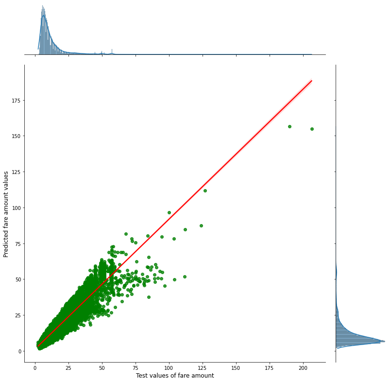

# Данные
Для задачи используется набор данных [Uber Fares
Dataset](https://www.kaggle.com/datasets/yasserh/uber-fares-dataset),
посвященный крупнейшей в мире таксомоторной компании Uber inc. Выборка
представлена сервисом Kaggle, являющимся крупнейшим 
в мире сообществом специалистов по науке о данных с мощными инструментами и 
ресурсами. 
Датасет представляет собой набор из более чем 196 тысяч строк с данными истории 
поездок и включает в себя информацию о геолокации начала и конца поездок, 
количестве пассажиров и цен за поездки. Выбранный набор данных состоит из 9 
столбцов: 
1.  index – уникальный номер (количественный признак)
2.	key – уникальный номер каждой поездки, представляющий собой дату и время в 
точности до 10-7секунды (количественный признак)
2.	fare_amount – стоимость каждой поездки в долларах США (количественный 
признак)
3.	pickup_datetime – дата и время, когда был включен счетчик (количественный 
признак)
4.	passenger_count – количество пассажиров в автомобиле (количественный 
признак)
5.	pickup_longitude – долгота, на которой счетчик был включен (количественный 
признак)
6.	pickup_latitude – широта, на которой счетчик был включен (количественный 
признак)
7.	dropoff_longitude – долгота, на которой счетчик был отключён (количественный 
признак)
8.	dropoff_latitude – широта, на которой счетчик был отключён (количественный 
признак)
***

# Предобработка 
Вся предобработка данных описывается в файле **all_code.ipynb**

# Модель
Для решения задачи прогнозирования цен на такси по вышеописанной структуре 
датасета была выбрана модель линейной регрессии

# Результаты
После предобработки данных получилось обучить модель линейной регрессии. По 
метрике R2 обучилась предсказывать цены на заказ такси с точностью 0.9046. 
Аналогичный вариант результата обучения можно увидеть по диаграмме остатков:

